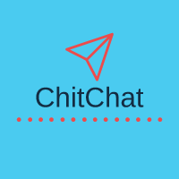

# ChitChat
<h1 align="center"CHITCHATT</h1>
<p align="center">

</p>
<h3 align="center">A real-time chat application website built using the toolset from the MERN stack.</h3>

<br />

<h2 align="center">🖥️ Tech Stack</h2>

<h4 align="center">Frontend:</h4>

<p align="center">
  
  
  
  
</p>

<h4 align="center">Backend:</h4>

<p align="center">
  
  
  

</p>

  </em>
</p>
<br />

## Table of Contents:

1) [Features](#fet)
2) [Getting Started](#install)
3) [Tech-Stack Used](#depend) 
4) [Contributors](#contri)

<a name="fet"></a>
## 🚀 Features

- User Registration: Users can create new accounts by providing their name, email, and password.
- User Authentication: Registered users can log in using their email and password.
- Real-time Messaging: Users can send and receive messages instantly, creating real-time conversations.
- User Profiles: Users can view and update their profiles, including their profile picture and status.
- Allow users to manage their contacts and easily initiate conversations with their friends or saved contacts.
-  Include a library of emojis and stickers to enrich the chat experience and express emotions visually.
- Integrated Socket.io for one-to-one chat and seamless experience.


<br />

<a name="install"></a> 
## Getting Started

This project was built using React, Redux, Sass, HTML, JavaScript, Node JS, Express and MongoDB with Sockets.io The app provides a seamless and responsive user interface for a smooth chatting experience. you should follow these guidelines.

1) Clone the repository using:
```bash
https://github.com/Vishesh-MNNIT/ChitChatt.git
```
2) Run the following in both the "client" and "server" folders:
```bash
npm install 
```
3) Start MongoDB and set up the following ENV files:

### Server
```
`MONGODB_URI`
e.g. mongodb cluster URI

`PORT`
e.g. PORT:3000

`NODE_ENV`
e.g. 'development' for local and 'production' for production
```
### Client
```
`REACT_APP_LOCALHOST_KEY`
e.g. chat-app-current-user
```
4) Run following in both "client" and "server" folders:
```bash
npm start
```
<a name="depend"></a>
## Tech-Stack Used

* NodeJS(ExpressJS) 
* React JS
* Vite-JS Template
* JavaScript
* MongoDB (as Database)
* Socket.io
*   
<a name="contri"></a>
## Contributors

* [Sourav Paul](https://github.com/PaulSaurav19)
* [Vishesh Agrawal](https://github.com/Vishesh-MNNIT)

## Feedback
Feel free to file an issue if you come across any bugs

### Made at:

<p align="center">

</p>
